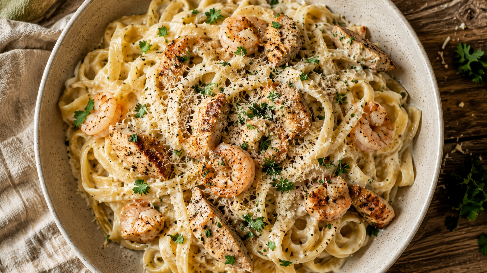

# Recipe Page Style Guide

A distilled record of the design system used on the Alfredo page, compiled from four review iterations across three expert reviewers (typography, editorial, web craft). Use this when adding new recipes so the collection feels like one book, not a folder of one-offs.

---

## 1. Design philosophy

**A recipe page is a love letter that happens to contain instructions.** Voice and layout do equal work. If the type, rhythm, and imagery don't carry warmth, no amount of polish on the recipe content will.

### The five rules

1. **Boxes test.** If you removed every border, background-colour, and box-shadow, the layout should still look intentional. Structure comes from typography, whitespace, and full-bleed images — never from cards.
2. **Modulated rhythm.** No metronomic full-bleed-image-every-section pattern. Mix one hero bleed, one closing payoff bleed, one half-bleed, plus small inset images inside paragraphs. Quiet → loud → quiet.
3. **Asymmetric grid.** Body column slightly off-centre with a marginalia rail on the right. Reference sections (ingredients, notes) tighten; narrative sections (intro, method, closing) breathe.
4. **Two-colour discipline.** Terracotta is for human/voice elements. Olive is for structural elements. They never swap roles. (See §3.)
5. **Voice over polish.** The dek, intro, sign-off, and any margin notes must sound like the author talking to one specific person. Cut anything that reads like a magazine standfirst.

---

## 2. Information architecture

A recipe is structured as five movements, in this exact order:

| # | Section | Purpose | Length |
|---|---|---|---|
| 1 | **Hero** | Full-viewport image + title + dek + meta strip + intro letter (2 paras) | ~viewport |
| 2 | **Ingredients** | One block (no aisle/cooking duplication). Shopping notes in the rail. | ~30 lines |
| 3 | **Method — proteins** ("First, the four pans") | 4 short prose steps with small inset images | ~120 lines |
| 4 | **Method — sauce** ("Then, the sauce") | Promoted spread: half-bleed image + 4-up sub-moves grid | ~80 lines |
| 5 | **Bringing it together → Notes → Closing letter → Sign-off** | Final assembly paragraph, then a 3-up notes block (lemon / texture / serve), then closing payoff bleed, then warm closing prose, then handwritten sign-off | ~80 lines |

Do **not** add: a "shopping list by aisle" duplicate of the ingredients, a separate "assembly" section that recaps the method, or a "tips & tricks" sidebar. They were tried and cut.

---

## 3. Colour palette

```css
--paper:       #f5ecdc;   /* warm ivory background */
--paper-warm:  #f1e6d2;   /* deeper paper, used for inset blocks */
--ink:         #221710;   /* body text */
--ink-soft:    #4a382a;   /* secondary text, captions */
--rule:        #c9b89a;   /* hairline rules, leaders */
--accent:      #9c4a2a;   /* terracotta — VOICE only */
--accent-deep: #7a3818;   /* terracotta darkened */
--accent-2:    #3a4a2a;   /* deep olive — STRUCTURE only */
```

### Role discipline (do not mix)

| Element | Colour |
|---|---|
| Drop cap | `--accent` |
| Ampersand in title | `--accent` |
| Pull quote | `--accent` |
| Handwritten margin note label | `--accent` |
| Sign-off (Caveat) | `--accent` |
| Step numerals (1–4 in pans, i–iv in sauce) | `--accent-2` |
| Hairline rules | `--accent-2` (or `--rule` for ingredient leaders) |
| Eyebrow / kicker / small-caps labels | `--accent-2` |
| Caption numerals (e.g. "01 / chicken in the pan") | `--accent-2` |
| `h2.ref` underline accent | `--accent-2` |
| Rail border | `--accent-2` (faded to `--rule` is OK) |

If you find yourself using terracotta for a numeral or olive for a sign-off, you've broken the rule — fix it, don't justify it.

---

## 4. Typography

### Fonts (Google Fonts, trimmed payload)

```html
<link href="https://fonts.googleapis.com/css2?family=Newsreader:opsz,wght@6..72,400;6..72,500;6..72,600&family=Newsreader:ital,opsz,wght@1,6..72,500&family=Inter:wght@500;600&family=Caveat:wght@600&display=swap" rel="stylesheet">
```

- **Newsreader** (variable serif, optical-size axis): body, headings, captions. The optical-size axis matters — large headings use opsz=48–72, body uses opsz=19, captions opsz=14.
- **Inter** (sans, 500/600 only): eyebrows, kickers, small-caps labels, captions.
- **Caveat** (handwritten, 600 only): sign-off and the occasional handwritten margin note label. **Do not** use for body or headings.

### Type scale

| Use | Family | Size | Line-height | Tracking |
|---|---|---|---|---|
| Body | Newsreader 400 | 19px | 1.55 | 0 |
| Pull quote | Newsreader italic 500 | 22px | 1.25 | 0 |
| Caption | Newsreader italic 14px | — | 1.5 | 0 |
| Eyebrow / kicker | Inter 500 | 12px uppercase | 1.55 | 0.22em |
| Small-caps label (rail, handnote) | Inter 600 | 10px uppercase | — | 0.22em |
| Hero title (h1) | Newsreader 600 | clamp(40px, 6.4vw, 78px) | 1.04 | -0.01em |
| Dek | Newsreader italic 18-22px | clamp(18, 1.6vw, 22) | 1.5 | 0 |
| h2.display (method spreads) | Newsreader 600 | ~52px | 1.05 | -0.01em |
| h2.ref (ingredients/notes) | Inter 600 SMALL CAPS | 14-16px | 1.4 | 0.22em |
| h2.aside (lemon/texture) | Newsreader italic 28-34px lowercase | — | 1.2 | 0 |
| Step numeral (pan, 1–4) | Newsreader italic 500 | 90-120px (hangs in left margin >=1200px, inline below) | 1 | 0 |
| Sub-move numeral (i–iv) | Newsreader italic 500 | 56px | 1 | 0 |
| Sign-off (Caveat) | 600 | 36-42px | 1 | 0 |

### Body settings (immutable)

- Measure: ~62ch (max-width 620px).
- Drop caps live on the FIRST paragraph of the intro only. `::first-letter` with optical margin tweaks (`margin-top: -0.05em; margin-left: -0.04em`).
- ASCII apostrophes only (`'`), em-dashes via `&mdash;`. Never curly quotes, never emoji, never ellipsis character (use three dots).
- UTF-8.

---

## 5. Layout & grid

### Frame

```
max-width: 1180px       (--frame)
horizontal padding: 28px
```

### Columns

```
body column: 620px      (--col)
rail:        220px      (--rail)
gutter:      56px       (--gutter)
```

### Asymmetric grid

```css
.frame {
  display: grid;
  grid-template-columns: 1fr var(--col) var(--gutter) var(--rail) 0.6fr;
  justify-content: start;   /* deliberately off-centre to the left */
}
```

The body sits in column 2, rail in column 4. The wider left blank (1fr) and narrower right blank (0.6fr) is what creates the asymmetry — don't centre it.

### Breakpoints

| Width | Behaviour |
|---|---|
| `>=1280px` | Full asymmetric grid + image insets float wider |
| `>=1200px` | Step numerals hang in left margin |
| `>=1024px` | Marginalia rail activates as a true second column |
| `>=720px` | 4-up sub-move grid kicks in |
| `<720px` | Single column, rail items collapse below their parent paragraph as inline marginalia, step numerals render inline at start of heading |

Mobile is **designed**, not just "stuff shrinks". Test at 375px.

### Whitespace cadence

| Section type | Section gap |
|---|---|
| Reference (ingredients, notes) | 32–40px |
| Narrative (method, intro, closing) | 120–160px |

---

## 6. Image system

### Rhythm rule

Across one recipe, images appear in this cadence:

| Slot | Type | Width | Height | Use |
|---|---|---|---|---|
| 1 | **Hero** full-viewport bleed | 100vw | 100svh | Finished plated dish |
| 2 | **Half-bleed right** | 50vw | ~70vh | Paired with sauce spread |
| 3–6 | **Inset** floated inside paragraph | ~360–440px | auto | Each protein/move step |
| 7 | (optional) **Quarter-page tipped-in** | ~280px | auto | Beside a long aside |
| 8 | **Full-bleed payoff** above closing letter | 100vw | ~70vh | Dramatic plating shot — the emotional landing |

Do **not** make every image a 70vh full-bleed. That was the original mistake. Vary scale or the page reads as a blog.

### Image attributes (non-negotiable)

```html
<!-- Hero -->
<link rel="preload" as="image" href="images/01-hero.png" fetchpriority="high">


<!-- Every other image -->

```

### Captions

```
01 / a fork lift, just before serving
```

- Sans, 11px, all-caps, `0.22em` tracked, range left.
- Leading numeral matches the step.
- Italic descriptive line beneath in serif if needed.

### File naming

`images/0X-subject.png` — zero-padded number prefix matching the narrative order, kebab-case subject. Examples: `01-hero.png`, `04-chicken-marinated.png`, `08-lemons.png`.

### Generating images

The 8 recipe images on the Alfredo page were AI-generated (ChatGPT GPT-4o image / Gemini Imagen 3) using prompts in this format. Reuse the style preamble for visual continuity across recipes:

> *"Warm natural daylight, shallow depth of field, soft rustic editorial food photography, muted ivory + terracotta + olive palette, slight film grain, top-down or 3/4 angle as specified. No text, no watermarks, photorealistic, 16:9 horizontal."*

Then a per-image prompt e.g. *"Overhead photograph of a shallow off-white ceramic bowl filled with [DISH], glossy, scattered with [GARNISH], linen napkin and wooden table just visible."*

---

## 7. Components

### Hero

- Full-viewport image (`100svh` with `100vh` fallback).
- Eyebrow: small-caps "for Mum's kitchen" or context line.
- Title: serif h1 with terracotta italic ampersand (`<em>&amp;</em>` styled).
- Dek: italic serif, **one** quiet sentence in author voice. No marketing copy.
- Meta strip: typeset row separated by `/`, no chips/badges.

### Ingredients

- ONE block. Subheadings via `<h3 class="ing-label">` + `<ul class="qty-list">`.
- "The main": dotted-leader rows (qty leader name).
- "The sauce": tabular figures, no leaders (qty right-aligned, name left-aligned).
- "Pantry check": comma-separated italic paragraph, **not** a list.
- Rail beside ingredients holds: shopping notes ("wedge not shaker for the parmesan") + a compact timeline ("chicken 12 min, prawns 3 min, sauce 8 min").

### Four pans (proteins)

- Section kicker: "First, the proteins" (warm).
- Single section-lede sentence stating the running order. The pan numbering MUST match the order in the lede.
- Each pan: large hanging numeral (1–4) in `--accent-2`, h3 step title, ~80–120 word prose paragraph, small inset image floated right or left.
- Rail items: pull quote + handnote + warning, ~3 items minimum or remove the rail for that section.

### Sauce spread (its own section)

- Section kicker: "Then, the sauce".
- Half-bleed photo (e.g. fork lifting strands) paired with the 4-up grid.
- 4-up grid: move (i) is a feature card 1.6× width with 96px italic numeral. Move (iii) is offset down 24px to create vertical rhythm. Moves ii and iv are standard.
- Each move: numeral (i–iv in `--accent-2`), block-level label ("Roux"), terse imperative beneath.

### Bringing it together

- Single short paragraph (~50 words) describing the literal final assembly.
- Optional inline italic instruction within: `<em>Toss the bacon through the pasta first.</em>`

### Notes block (footer 3-up)

- Single header `h2.ref` "Notes".
- Three columns:
  1. **The imperatives** — 4 short bulleted lines, parallel sentence lengths.
  2. **Texture rescue** — a couple of lines.
  3. **Serve with** — single elegant prose line, no chips.
- Lemon safety note as a separate `h2.aside` with a thin top rule, above or below the notes block.

### Closing payoff + letter + sign-off

- Full-bleed payoff image (the most dramatic plating shot).
- 2–3 sentence closing letter in author's voice. Specific, not generic. End with one actionable warm line ("ring me if anything's unclear").
- Sign-off in Caveat 36–42px, slightly rotated (~3°), padded to avoid descender clipping (`padding: 6px 16px; transform-origin: left center`).

### Marginalia rail (>=1024px)

- Lives in column 4 of the asymmetric grid.
- 3–4 substantive items per section it accompanies.
- Item types:
  - **Pull quote**: italic serif terracotta, ~22px.
  - **Handnote**: small-caps Inter label in terracotta + 1–2 lines body in serif. Label like "A note from me —". Avoid third-person self-reference.
  - **Warning**: small-caps "a small warning" in `--accent`, 1–2 lines body.
  - **Sidenote**: tiny inset photo + caption.
- On mobile, rail items collapse below the paragraph they belong to as inline marginalia (italic serif, smaller).

---

## 8. Editorial voice rules

### Do

- Write to one specific person. Use second-person to that person.
- Be specific. "Wednesday night, the second time Stina asked" beats "a perfect midweek dinner".
- Include a memory beat in the intro before any method.
- Use sensory verbs: render, brown, fold, stream, lift.
- Vary sentence length. Crisp imperative → longer reflective → crisp imperative.
- Repeat key warnings in two registers (a body line + a rail warning) — but never the same words.

### Don't

- Don't preview the method in the intro ("we'll air-fry the chicken, then…"). The recipe will appear when the reader gets there.
- Don't write a magazine standfirst. ("A creamy, restaurant-style pasta — made at home.") Read it aloud — if it sounds like a press release, cut it.
- Don't use generic closers ("Cook slow, taste as you go"). Find one specific, useful sentence.
- Don't refer to yourself in third person ("Aalan's note"). Use "A note from me —" or just let the styling carry it.
- Don't double-up rail and body content saying the same thing in similar words.
- Don't capitalise "italian herbs" or "italian-ish" — lowercase reads warmer.
- Don't add an "Italian-ish" cuisine descriptor in the meta strip. Cut the cuisine entirely.

---

## 9. Anti-patterns (we tried these; they broke)

| Anti-pattern | Why it failed |
|---|---|
| Single-column blog spine | Reads as a blog regardless of typography polish |
| Equal-weight full-bleed images every section | Metronome rhythm, no narrative emphasis |
| Cards / boxes / panels around every section | Fails the boxes test; everything floats in mid-air |
| One terracotta accent doing all the work | Page reads as one-note; second colour adds structure |
| "Section one" / "Section two" as kickers | Cold; replace with warm phrasing |
| Sauce as "step v" buried at the bottom | Demotes the most important moment of the recipe |
| Duplicate ingredient lists (by aisle + by quantity) | Reader does the same scan twice |
| Three separate recap sections (assembly + texture + serve) | Reads as filler; combine into one Notes block |
| "Aalan's note:" labels | Third-person about oneself to one's mother is awkward |
| Pull quote centred mid-column | Breaks reading flow; put it in the rail |
| `width: 100vw` + `margin-left: -50vw` for bleeds | Causes horizontal scrollbar bug on Windows. Use `margin-inline: calc(50% - 50vw)` + `html { overflow-x: clip }` |
| Full-bleed hero in print | Wastes ink. Hide hero on print. |

---

## 10. Adding a new recipe — checklist

1. **Duplicate** the existing `index.html` to `recipes/<slug>.html` (and update root navigation to link to it).
2. **Generate 8 images** using the same style preamble (§6). Save as `images/<slug>/0X-name.png`.
3. **Update tokens only if intentional**. Keep palette and type scale. The collection should feel like one book.
4. **Re-write voice**: hero meta strip, dek, intro 2 paragraphs, kickers, sign-off.
5. **Re-structure** to fit the 5-movement IA (§2). Some recipes won't have a sauce → swap that spread for "the bake" or "the marinade", but keep the half-bleed paired-with-grid pattern.
6. **Verify pan numbering** matches the running-order lede. (#1 reviewer trap.)
7. **Run the boxes test**: comment out borders/backgrounds/shadows in dev tools. Layout should still hold.
8. **Run the rhythm test**: scroll through. Are there ≥3 different image scales (full-bleed, half-bleed, inset)? If every image is the same scale, fix it.
9. **Run the voice test**: read intro and closing aloud. Do they sound like talking to one specific person? If they sound like a magazine, rewrite.
10. **Print preview**: 3–6 pages, no full-bleed glossy, headings stay with their paragraphs.
11. **Mobile test at 375px**: rail collapses cleanly, no horizontal scroll, hanging numerals render inline.
12. **Accessibility**: all images have descriptive alt text, heading order is linear, contrast >=4.5:1.

---

## 11. Reviewer scoring rubric (use to self-grade)

For each new recipe, score:

| Lens | Pass threshold |
|---|---|
| **Web craft** | No console errors. No horizontal scroll. Lighthouse perf >85. Print preview clean. |
| **Typography** | ≥9/10. Asymmetric layout. Image scale modulated. Two-colour discipline holds. |
| **Editorial** | ≥9/10. Voice is specific to one reader. No method-preview in intro. Pan order matches lede. Closing has one specific actionable line. |

If any lens scores under 9, iterate before publishing. The Alfredo page took four iterations to clear all three.

---

*Maintained by Aalan. Last updated: May 2026.*
